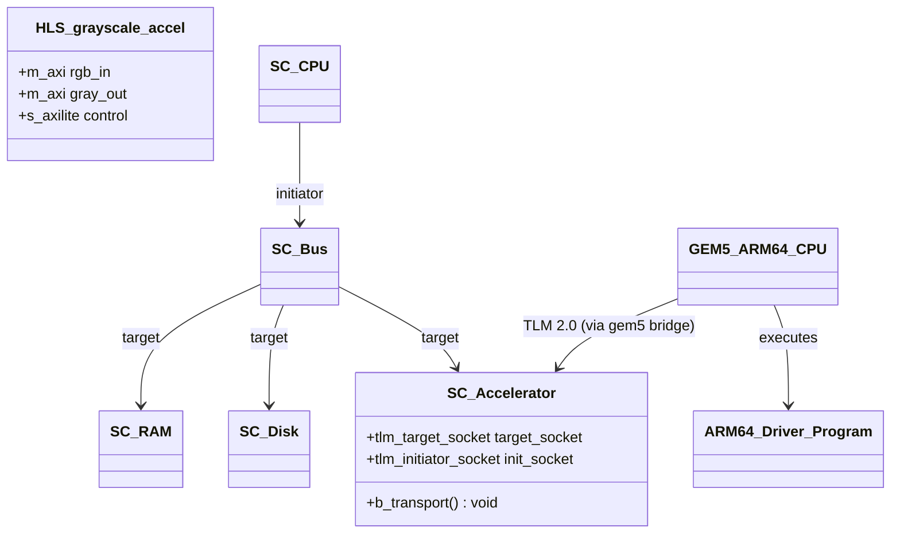
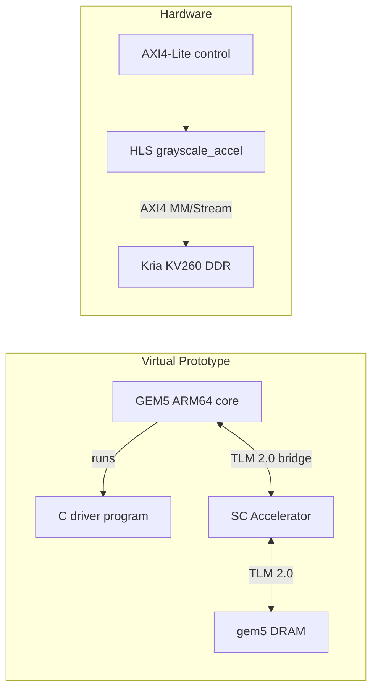
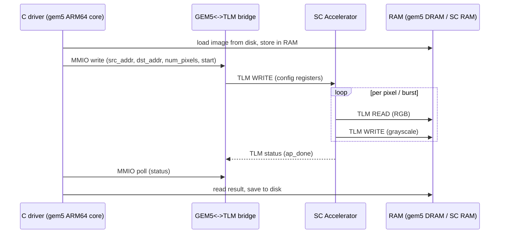

# Vitis HLS + GEM5 Image Accelerator

> Academic project — MP6160 Diseño de Alto Nivel de Sistemas Electrónicos, Instituto Tecnológico de Costa Rica
> Evaluación Corta 2 — continues [mp6160-systemc-tlm-image-accelerator](https://github.com/Team-Diseno-de-Alto-Nivel/mp6160-systemc-tlm-image-accelerator)

Converts the transaction-level (SystemC/TLM 2.0) RGB→grayscale accelerator model from the previous evaluation into (1) a synthesizable **Vitis HLS** implementation targeting the **AMD Kria KV260** and (2) a virtual prototype where the same accelerator is driven by a **GEM5** ARM64 system over **TLM 2.0**.

**Team:** Gabriel Abarca Aguilar, Jesús Alberto Castro Murillo, José Fabio Jaramillo Cordero, Moisés Leiva Solano, Noel Antonio Pérez Cáceres

---

## Table of Contents

- [Requirements & Build Instructions](#requirements--build-instructions)
- [Repository Organization](#repository-organization)
- [Module Organization](#module-organization)
- [Block Diagram](#block-diagram)
- [Sequence Diagram](#sequence-diagram)
- [Transaction Format](#transaction-format)
- [Memory Map](#memory-map)
- [Results](#results)
- [AI-Assisted Development](#ai-assisted-development)

---

## Requirements & Build Instructions

### Virtual prototype — standalone SystemC model

Same model and build flow as the previous evaluation; useful as a fast regression reference for the accelerator's behavior, independent of HLS/gem5.

```bash
make run-model   # prepare_input.py -> image.raw, then configure + compile + run
make check       # verify output.raw byte-for-byte against the BT.601 reference
```

`make run-model` first runs `scripts/prepare_input.py`, which regenerates the
git-ignored `images/input/image.raw` from the tracked `images/input/image.jpg`
(needs Pillow). `$SYSTEMC_HOME` is optional — if unset, CMake downloads and
builds SystemC 2.3.4 automatically on first configure (requires internet).

### Virtual prototype — GEM5 + ARM64

The accelerator is compiled **into** gem5 (`scons EXTRAS=`) from the same source
the standalone sim uses, and attached as an MMIO peripheral through gem5's
SystemC/TLM bridges. Requires a gem5 **source tree** — a `gem5.opt` on `$PATH` is
not enough. See [`src/gem5/README.md`](src/gem5/README.md)
for the topology and the SE-vs-FS rationale.

```bash
make gem5   GEM5_ROOT=/path/to/gem5   # build gem5 with the accelerator compiled in
make run-vp GEM5_ROOT=/path/to/gem5   # cross-compile the driver, then run the system
make check                            # verify the output against the BT.601 reference
```

The driver is cross-compiled for gem5 SE mode by default. For the real KV260,
configure it with `-DGEM5_SE=OFF` to restore the `mmap(/dev/mem)` path:

```bash
cd src/program
make          # cross-compiles the ARM64 driver with aarch64-linux-gnu-gcc
```

### HLS (Vitis 2024.1)

Status: **scaffolding only** — kernel interfaces/pragmas and the co-simulation flow are wired up, the RGB→grayscale pipeline body is a TODO. Target: Kria KV260 (`xck26-sfvc784-2LV-c`), 250 MHz.

```bash
cd src/hls/scripts
vitis_hls -f run_hls.tcl
```

### Development Container

Carries the previous evaluation's dev container (SystemC 2.3.4 prebuilt at `/opt/systemc`), plus the `aarch64-linux-gnu` cross-toolchain the ARM64 driver needs and Pillow/numpy for `scripts/`. It now also ships a **gem5 source tree at `/opt/gem5`** (`GEM5_ROOT` pre-set) with gem5's build dependencies, so the whole virtual-prototype track runs inside the container — the heavy `scons` build is not done at image-build time (it links this repo's `src/`, mounted at runtime), so run `make gem5` once inside (~30–60 min) then `make run-vp`. **Vitis HLS is still not containerized** — it needs its own install/license and runs outside the container.

```bash
docker build -t vitis-hls-accel .devcontainer/
docker run -it --rm -v $(pwd):/workspace -w /workspace vitis-hls-accel make run-model
```

### CI/CD

[`.github/workflows/build.yml`](.github/workflows/build.yml) runs on every push to `main` and every pull request, and validates compilation only (no Vitis/gem5 install in CI):

- builds and runs the standalone SystemC model,
- cross-compiles the ARM64 driver,
- compiles the HLS kernel + testbench with the host `g++` (catches syntax/type errors — not a substitute for `csim`/`csynth` in real Vitis HLS),
- checks the gem5 config's Python syntax.

---

## Repository Organization

```
.
├── .devcontainer/                  # Dev container for the SystemC/host build (unchanged from prior eval)
├── docs/
│   └── Enunciado.md                 # Assignment specification (Spanish)
├── images/
│   ├── input/image.jpg              # Source image (tracked); prepare_input.py -> image.raw
│   ├── input/image.raw              # RAW RGB 1080p input — generated, git-ignored
│   └── output/                      # output.raw etc. — generated by the pipeline, git-ignored
├── scripts/                         # prepare_input / raw_to_jpg / jpg_to_raw / check_output
├── src/                             # All source code — one subfolder per project
│   ├── common/                       # Memory map + image format — shared by the model, the
│   │   ├── memory_map.h              #   driver (C) and the gem5 config (parsed). Single
│   │   └── image_config.h           #   source of truth for every address in the system.
│   ├── model/                        # Standalone SystemC/TLM 2.0 model (regression reference)
│   │   ├── {cpu,bus,ram,disk,accelerator,utils}/  # one .h/.cpp pair per module
│   │   └── main.cpp
│   ├── program/                      # C driver cross-compiled for ARM64, run by the gem5 core
│   │   └── main.c
│   ├── gem5/                         # GEM5 ARM64 system + TLM<->gem5 bridge
│   │   ├── configs/kv260_arm64.py    #   SE-mode ARM64 system + bridges + identity maps
│   │   ├── SConscript, Accelerator.py, accelerator_wrapper.{cc,hh}  # SimObject glue (scons EXTRAS=<repo>/src)
│   └── hls/                          # Vitis HLS implementation (hardware track)
│       ├── grayscale_accel.{h,cpp}   #   AXI interfaces wired; pipeline body TODO
│       ├── tb/grayscale_accel_tb.cpp #   Co-simulation testbench
│       └── scripts/run_hls.tcl       #   csim -> csynth -> cosim -> export_design
├── Makefile                          # Delegates to src/model, src/program, src/gem5, src/hls
└── README.md
```

---

## Module Organization



| Module | Location | Role | Responsibility |
|---|---|---|---|
| **HLS kernel** | `src/hls/` | Synthesizable accelerator | RGB→grayscale, AXI4 (MM/Stream) data + AXI4-Lite control, pipelined |
| **SC Accelerator** | `src/model/accelerator/` | TLM target | Same accelerator behavior, in SystemC. The exact same source is compiled into both the standalone sim and gem5 |
| **SC CPU/Bus/RAM/Disk** | `src/model/{cpu,bus,ram,disk}` | TLM initiator/target | Standalone regression sim — unchanged from the previous evaluation |
| **GEM5 ARM64 system** | `src/gem5/` | — | Replaces `SC CPU` with a real simulated ARM64 core; bridges its memory bus to the SC Accelerator over TLM 2.0 |
| **ARM64 driver program** | `src/program/` | Software | C program run by the gem5 core; replaces `CPU::run()`'s behavioral logic with real MMIO register access |

---

## Block Diagram



### Standalone SystemC model (regression reference)

Unchanged from the previous evaluation — see `src/model/*`. CPU loads the image from Disk, stores it in RAM, configures the Accelerator (source address, destination address, pixel count), waits for completion, then reads the result back from RAM and saves it to Disk. All inter-module data passes through RAM; the Bus routes by address range.

### HLS accelerator

`grayscale_accel(rgb_in, gray_out, num_pixels)`, exposed over one or two `m_axi` ports (burst read/write to DDR) plus an `s_axilite` control bundle (base addresses + pixel count + `ap_start`/`ap_done`). The pipeline must separate the I/O stages (burst read/write) from the compute stage (RGB→gray) — implementation pending, see `src/hls/grayscale_accel.cpp`.

### GEM5 virtual prototype

Replaces the behavioral `CPU` SystemC module with an actual ARM64 core simulated by gem5, running the C driver in `src/program`. The core's memory-mapped I/O to the accelerator's config registers is carried over gem5's SystemC/TLM bridges to the same `Accelerator` TLM module used by the standalone model — see `src/gem5/README.md` for the topology and the SE-mode rationale.

---

## Sequence Diagram



---

## Transaction Format

All inter-module communication in the virtual prototype uses the TLM 2.0 generic payload (`tlm::tlm_generic_payload`), same as the previous evaluation:

| Field | Type | Description |
|---|---|---|
| `command` | `tlm_command` | `TLM_READ_COMMAND` or `TLM_WRITE_COMMAND` |
| `address` | `uint64_t` | Absolute byte address on the bus |
| `data_ptr` | `unsigned char*` | Pointer to the data buffer |
| `data_length` | `unsigned int` | Transfer size in bytes |
| `response_status` | `tlm_response_status` | `TLM_OK_RESPONSE` on success, error codes otherwise |

On the hardware side, the HLS kernel exposes an AXI4 (Memory-Mapped or Stream) data interface plus an AXI4-Lite control interface — see Memory Map below.

### Accelerator configuration transactions

The accelerator is programmed through the AXI4-Lite register block described in
[Memory Map](#memory-map) — three 32-bit register WRITEs, then a WRITE of
`ap_start`, then 32-bit READs of `CTRL` polling `ap_done`. Identical whether the
initiator is the SystemC `CPU` module, the ARM64 driver through gem5's bridge,
or the AXI4-Lite master on the KV260.

> Changed from the previous evaluation, which used a single 24-byte config blob
> plus a status register at `0x10000018`. That layout could not survive contact
> with HLS: `s_axilite` generates individually addressable 32-bit registers, and
> its `GRAY_OUT_ADDR` lands exactly on the old status address. Adapting the model
> is what the assignment means by *"con algunas adaptaciones adicionales"*, and
> it collapses the SystemC model, the driver and the HLS kernel onto one
> programming model.

---

## Memory Map

Single source of truth: [`src/common/memory_map.h`](src/common/memory_map.h).
The SystemC model and the ARM64 driver both `#include` it, and the gem5 config
parses it at startup — so the tables below cannot silently drift from the code.

### Accelerator AXI4-Lite control registers

Identical in all three implementations. Base is `0x10000000` in both the
standalone model and the gem5 system; on the KV260 it is the peripheral base
assigned in the Vivado/Vitis address editor (TBD once the block design is built).

| Offset | Register | Access | Description |
|---|---|---|---|
| `0x00` | `CTRL` | R/W | bit0 `ap_start` (W), bit1 `ap_done` (R). HLS also drives bit2 `ap_idle`, bit3 `ap_ready`, bit7 `auto_restart` |
| `0x10` | `RGB_IN_ADDR` | R/W | Base address of the input RGB image |
| `0x18` | `GRAY_OUT_ADDR` | R/W | Base address of the output grayscale image |
| `0x20` | `NUM_PIXELS` | R/W | Total pixels to process |

Addresses are 32-bit — `run_hls.tcl` sets `config_interface -m_axi_addr64=0`.
Flipping that to 1 adds upper-half registers at `+0x14`/`+0x1c` and this table
must grow with it.

> Vitis HLS additionally generates the interrupt block (`GIER` @ `0x04`,
> `IER` @ `0x08`, `ISR` @ `0x0C`); the SystemC model does not implement it, since
> both the driver and the `CPU` module poll `ap_done` rather than use interrupts.
> The `RGB_IN_ADDR`/`GRAY_OUT_ADDR`/`NUM_PIXELS` offsets are auto-generated by
> `v++`/Vitis HLS from the kernel's argument order (see `src/hls/grayscale_accel.cpp`)
> — confirm them against the exported driver header (`xgrayscale_accel_hw.h` under
> `src/hls/scripts/grayscale_accel_prj/solution1/impl/`) once synthesis has run, and
> reconcile `memory_map.h` if they differ.

### Standalone SystemC model

| Region | Base Address | Size | Module |
|---|---|---|---|
| Input RGB image | `0x00000000` | 6,220,800 B (~5.9 MB) | RAM |
| Output grayscale image | `0x00600000` | 2,073,600 B (~1.9 MB) | RAM |
| Accelerator control | `0x10000000` | 4 KiB | Accelerator |
| Disk | `0x20000000` | — | Disk (`+0x0` input image, `+0x1000000` output) |

RAM total capacity: 64 MB (`0x00000000`–`0x03FFFFFF`).

### GEM5 MMIO map

| Region | Base Address | Size | Notes |
|---|---|---|---|
| Accelerator control | `0x10000000` | 4 KiB | Behind `Gem5ToTlmBridge32` |
| Input RGB image | `0x80000000` | 6,220,800 B | `SimpleMemory`, identity-mapped into the driver |
| Output grayscale image | `0x80600000` | 2,073,600 B | same region |
| Process heap/stack | `0x100000000` | 512 MiB | `system.mem_ranges` — kept away from the buffers so gem5's SE page allocator cannot collide with the identity map |

The accelerator reaches the buffers through whatever it is handed in
`RGB_IN_ADDR`/`GRAY_OUT_ADDR` at runtime, which is why the same module works
unchanged at both `0x00000000` (model) and `0x80000000` (gem5).

---

## Results

### Standalone SystemC model — verified

`make run-model` converts the real 1080p input through the full
Disk → RAM → Accelerator → RAM → Disk flow.

| Transfer | Expected | Actual | |
|---|---|---|---|
| Disk → RAM (input) | 6,220,800 B | 6,220,800 B | ✅ |
| RAM → Disk (output) | 2,073,600 B | 2,073,600 B | ✅ |

`make check` recomputes the BT.601 reference on the host from
`images/input/image.raw` and compares byte for byte:

```
OK    images/output/output.raw  (standalone SystemC model): 2073600 pixels match BT.601
```

The output is also bit-identical to the previous evaluation's verified result
(`sha256 e244fefe…`), which confirms that moving the accelerator from the
24-byte config blob to the AXI4-Lite register block did not change its
behaviour.

### Output image

<!-- Side-by-side comparison of the input RGB image and the HLS/gem5 output. -->

### GEM5 simulation log

_Pending a first run — needs a gem5 source tree (`make gem5 GEM5_ROOT=…`). The
config, the SimObject glue and the SE-mode driver path are implemented; see
[`src/gem5/README.md`](src/gem5/README.md) for the
one known risk to validate on that run._

### HLS synthesis / co-simulation report

_Pending — the kernel pipeline body is still a TODO in `src/hls/grayscale_accel.cpp`._

<!-- Resource utilization (LUT/FF/BRAM/DSP), timing closure at 250 MHz, cosim latency. -->

---

## AI-Assisted Development

Declared as required by course policy — see [docs/Enunciado.md](docs/Enunciado.md).

> **Using Claude Code?** Run `/log-ai` in any Claude Code session inside this repo to append a row to the table below automatically. The command asks for model, type of use, and prompt description.

| Model | Type of use | Prompt |
|---|---|---|
| Claude Sonnet 5 ([Claude Code](https://claude.ai/code)) | Concept lookup, documentation generation, diagram generation, repo scaffolding | *"Create a new repo based on mp6160-systemc-tlm-image-accelerator to start shaping the HLS + GEM5 evaluation: reuse the previous SystemC/TLM model, add scaffolding (not implementation) for the Vitis HLS kernel/testbench/TCL flow and for the GEM5 ARM64 + TLM virtual prototype, and update the README with the new architecture, memory map, and diagrams."* |
