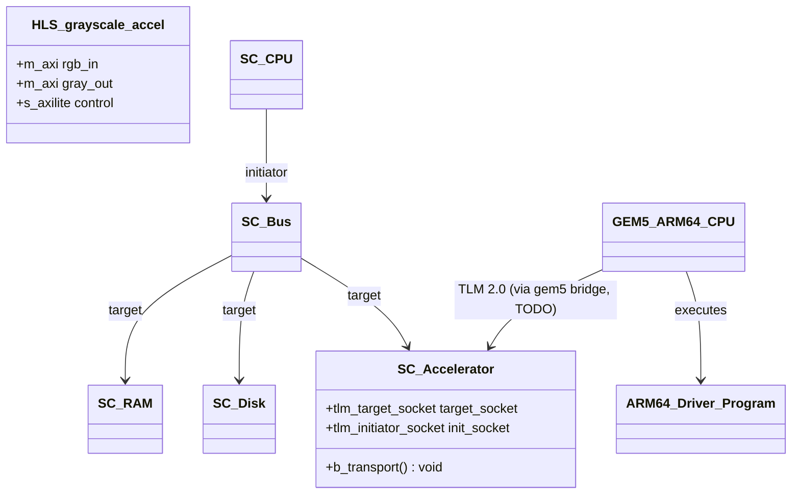
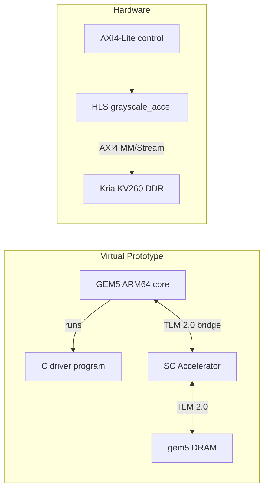
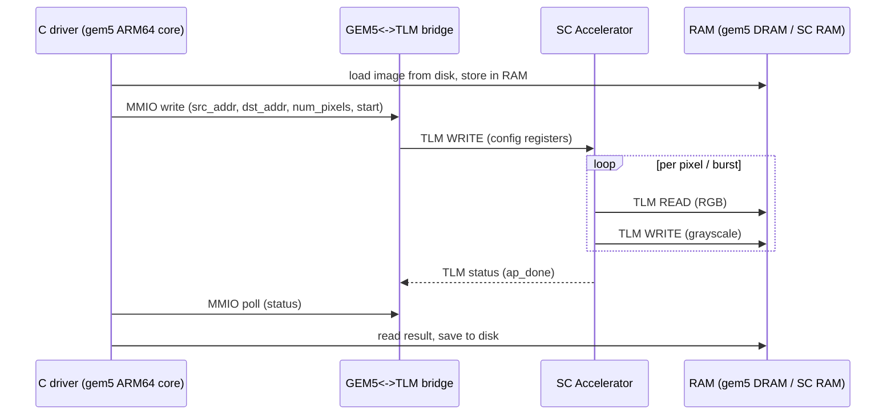

# Vitis HLS + GEM5 Image Accelerator

> Academic project — MP6160 Diseño de Alto Nivel de Sistemas Electrónicos, Instituto Tecnológico de Costa Rica
> Evaluación Corta 2 — continues [mp6160-systemc-tlm-image-accelerator](https://github.com/Team-Diseno-de-Alto-Nivel/mp6160-systemc-tlm-image-accelerator)

Converts the transaction-level (SystemC/TLM 2.0) RGB→grayscale accelerator model from the previous evaluation into (1) a synthesizable **Vitis HLS** implementation targeting the **AMD Kria KV260** and (2) a virtual prototype where the same accelerator is driven by a **GEM5** ARM64 system over **TLM 2.0**.

**Team:** Gabriel Abarca Aguilar, Jesús Alberto Castro Murillo, José Fabio Jaramillo Cordero, Moisés Leiva Solano, Noel Antonio Pérez Cáceres

---

## Table of Contents

- [Requirements & Build Instructions](#requirements--build-instructions)
- [Repository Organization](#repository-organization)
- [Module Organization](#module-organization)
- [Block Diagram](#block-diagram)
- [Sequence Diagram](#sequence-diagram)
- [Transaction Format](#transaction-format)
- [Memory Map](#memory-map)
- [Results](#results)
- [AI-Assisted Development](#ai-assisted-development)

---

## Requirements & Build Instructions

### Virtual prototype — standalone SystemC model

Same model and build flow as the previous evaluation; useful as a fast regression reference for the accelerator's behavior, independent of HLS/gem5.

```bash
cd virtual-prototype/systemc-model
make run      # configure + compile + run the simulation
```

`$SYSTEMC_HOME` is optional — if unset, CMake downloads and builds SystemC 2.3.4 automatically on first configure (requires internet).

### Virtual prototype — GEM5 + ARM64

Status: **scaffolding only**, see [`virtual-prototype/gem5/README.md`](virtual-prototype/gem5/README.md) and [`virtual-prototype/program`](virtual-prototype/program) for what's pending (ARM64 system config, TLM↔gem5 bridge wiring, driver register access).

```bash
cd virtual-prototype/program
make          # cross-compiles the ARM64 driver with aarch64-linux-gnu-gcc
```

### HLS (Vitis 2024.1)

Status: **scaffolding only** — kernel interfaces/pragmas and the co-simulation flow are wired up, the RGB→grayscale pipeline body is a TODO. Target: Kria KV260 (`xck26-sfvc784-2LV-c`), 250 MHz.

```bash
cd hls/scripts
vitis_hls -f run_hls.tcl
```

### Development Container

The repository ships the same dev container as the previous evaluation (SystemC + host C++ toolchain). Vitis HLS and gem5 are **not** containerized here — they require their own installs/licenses and are run outside the dev container.

```bash
docker build -t vitis-hls-accel .devcontainer/
docker run -it --rm -v $(pwd):/workspace -w /workspace vitis-hls-accel make run-model
```

### CI/CD

[`.github/workflows/build.yml`](.github/workflows/build.yml) runs on every push to `main` and every pull request, and validates compilation only (no Vitis/gem5 install in CI):

- builds and runs the standalone SystemC model,
- cross-compiles the ARM64 driver,
- compiles the HLS kernel + testbench with the host `g++` (catches syntax/type errors — not a substitute for `csim`/`csynth` in real Vitis HLS),
- checks the gem5 config's Python syntax.

---

## Repository Organization

```
.
├── .devcontainer/                  # Dev container for the SystemC/host build (unchanged from prior eval)
├── docs/
│   └── Enunciado.md                 # Assignment specification (Spanish)
├── images/
│   ├── input/                       # Input RAW RGB images (place here before running)
│   └── output/                      # Output images written by the model / HLS testbench
├── hls/                             # Vitis HLS implementation (hardware track)
│   ├── src/
│   │   ├── grayscale_accel.h
│   │   └── grayscale_accel.cpp      # AXI interfaces wired; pipeline body TODO
│   ├── tb/
│   │   └── grayscale_accel_tb.cpp   # Co-simulation testbench skeleton
│   └── scripts/
│       └── run_hls.tcl              # csim -> csynth -> cosim -> export_design
├── virtual-prototype/               # Virtual prototype track (SystemC/TLM + GEM5/ARM64)
│   ├── systemc-model/                # Standalone TLM 2.0 model, carried over from the prior evaluation
│   │   └── src/{cpu,bus,ram,disk,accelerator,utils}/
│   ├── gem5/                         # GEM5 ARM64 system + TLM<->gem5 bridge (scaffolding)
│   │   └── configs/kv260_arm64.py
│   └── program/                      # C driver cross-compiled for ARM64, run by the gem5 core
│       └── src/main.c
├── Makefile                          # Delegates to systemc-model / program / hls
└── README.md
```

---

## Module Organization



| Module | Location | Role | Responsibility |
|---|---|---|---|
| **HLS kernel** | `hls/src/` | Synthesizable accelerator | RGB→grayscale, AXI4 (MM/Stream) data + AXI4-Lite control, pipelined |
| **SC Accelerator** | `virtual-prototype/systemc-model/src/accelerator/` | TLM target | Same accelerator behavior, in SystemC, reused by both the standalone sim and (pending) the gem5 bridge |
| **SC CPU/Bus/RAM/Disk** | `virtual-prototype/systemc-model/src/{cpu,bus,ram,disk}` | TLM initiator/target | Standalone regression sim — unchanged from the previous evaluation |
| **GEM5 ARM64 system** | `virtual-prototype/gem5/` | — | Replaces `SC CPU` with a real simulated ARM64 core; bridges its memory bus to the SC Accelerator over TLM 2.0 |
| **ARM64 driver program** | `virtual-prototype/program/` | Software | C program run by the gem5 core; replaces `CPU::run()`'s behavioral logic with real MMIO register access |

---

## Block Diagram



### Standalone SystemC model (regression reference)

Unchanged from the previous evaluation — see `virtual-prototype/systemc-model/src/*`. CPU loads the image from Disk, stores it in RAM, configures the Accelerator (source address, destination address, pixel count), waits for completion, then reads the result back from RAM and saves it to Disk. All inter-module data passes through RAM; the Bus routes by address range.

### HLS accelerator

`grayscale_accel(rgb_in, gray_out, num_pixels)`, exposed over one or two `m_axi` ports (burst read/write to DDR) plus an `s_axilite` control bundle (base addresses + pixel count + `ap_start`/`ap_done`). The pipeline must separate the I/O stages (burst read/write) from the compute stage (RGB→gray) — implementation pending, see `hls/src/grayscale_accel.cpp`.

### GEM5 virtual prototype

Replaces the behavioral `CPU` SystemC module with an actual ARM64 core simulated by gem5, running the C driver in `virtual-prototype/program`. The core's memory-mapped I/O to the accelerator's config registers is carried over gem5's SystemC/TLM co-simulation bridge to the same `Accelerator` TLM module used by the standalone model — implementation pending, see `virtual-prototype/gem5/README.md`.

---

## Sequence Diagram



---

## Transaction Format

All inter-module communication in the virtual prototype uses the TLM 2.0 generic payload (`tlm::tlm_generic_payload`), same as the previous evaluation:

| Field | Type | Description |
|---|---|---|
| `command` | `tlm_command` | `TLM_READ_COMMAND` or `TLM_WRITE_COMMAND` |
| `address` | `uint64_t` | Absolute byte address on the bus |
| `data_ptr` | `unsigned char*` | Pointer to the data buffer |
| `data_length` | `unsigned int` | Transfer size in bytes |
| `response_status` | `tlm_response_status` | `TLM_OK_RESPONSE` on success, error codes otherwise |

On the hardware side, the HLS kernel exposes an AXI4 (Memory-Mapped or Stream) data interface plus an AXI4-Lite control interface — see Memory Map below.

### Accelerator configuration transaction (SystemC model, unchanged)

A single 24-byte WRITE to the Accelerator's base address (`0x10000000`):

| Offset | Size | Field |
|---|---|---|
| `+0` | 8 B | Source base address in RAM (input RGB) |
| `+8` | 8 B | Destination base address in RAM (output grayscale) |
| `+16` | 8 B | Total pixel count |

Status is read back as a 4-byte value at `0x10000018`.

---

## Memory Map

### Standalone SystemC model (unchanged from the previous evaluation)

| Region | Base Address | Size | Module |
|---|---|---|---|
| Input RGB image | `0x00000000` | 6,220,800 B (~5.9 MB) | RAM |
| Output grayscale image | `0x00600000` | 2,073,600 B (~1.9 MB) | RAM |
| Accelerator config | `0x10000000` | 24 B | Accelerator |
| Disk | `0x20000000` | — | Disk |

RAM total capacity: 64 MB (`0x00000000`–`0x03FFFFFF`).

### HLS AXI4-Lite control register map

Base offset is the accelerator's peripheral base in the Vivado/Vitis address editor (TBD once the block design is built for the Kria KV260 — record it here once known).

| Offset | Register | Access | Description |
|---|---|---|---|
| `0x00` | `CTRL` | R/W | bit0 `ap_start`, bit1 `ap_done`, bit2 `ap_idle`, bit3 `ap_ready`, bit7 `auto_restart` |
| `0x04` | `GIER` | R/W | Global Interrupt Enable (bit0) |
| `0x08` | `IER` | R/W | IP Interrupt Enable: bit0=`ap_done`, bit1=`ap_ready` |
| `0x0C` | `ISR` | R/W1C | IP Interrupt Status |
| `0x10` | `RGB_IN_ADDR` | R/W | Base address of the input RGB image in DDR |
| `0x18` | `GRAY_OUT_ADDR` | R/W | Base address of the output grayscale image in DDR |
| `0x20` | `NUM_PIXELS` | R/W | Total pixels to process |

> Exact offsets for `RGB_IN_ADDR`/`GRAY_OUT_ADDR`/`NUM_PIXELS` are auto-generated by `v++`/Vitis HLS from the kernel's argument order (see `hls/src/grayscale_accel.cpp`) — confirm against the exported driver header (`xgrayscale_accel_hw.h` or equivalent under `hls/scripts/grayscale_accel_prj/solution1/impl/`) once synthesis has run, and update this table if they differ.

### GEM5 MMIO map

Fixed by the driver ([`virtual-prototype/program/src/main.c`](virtual-prototype/program/src/main.c)); the gem5 ARM64 config must place the accelerator and DRAM at these same addresses:

| Region | Base Address | Size | Notes |
|---|---|---|---|
| Accelerator control | `0x10000000` | one page (4 KiB) | `CTRL` @ `+0x00` (bit0 `ap_start`, bit1 `ap_done`), `RGB_IN_ADDR` @ `+0x10`, `GRAY_OUT_ADDR` @ `+0x18`, `NUM_PIXELS` @ `+0x20` |
| Input RGB image | `0x80000000` | 6,220,800 B | DRAM |
| Output grayscale image | `0x80600000` | 2,073,600 B | DRAM |

The driver accesses all three via `mmap()` on `/dev/mem` (requires root) — no kernel driver is used. Whoever wires the gem5 TLM bridge should place the `Accelerator`'s target socket at `0x10000000` and back the two image regions with gem5's DRAM at the addresses above.

---

## Results

_Not yet available — hardware and gem5 integration are under development._

### Output image

<!-- Side-by-side comparison of the input RGB image and the HLS/gem5 output. -->

### HLS synthesis / co-simulation report

<!-- Resource utilization (LUT/FF/BRAM/DSP), timing closure at 250 MHz, cosim latency. -->

### GEM5 simulation log

<!-- Paste relevant gem5 stdout/stats.txt excerpts once the ARM64 + TLM bridge run end to end. -->

---

## AI-Assisted Development

Declared as required by course policy — see [docs/Enunciado.md](docs/Enunciado.md).

> **Using Claude Code?** Run `/log-ai` in any Claude Code session inside this repo to append a row to the table below automatically. The command asks for model, type of use, and prompt description.

| Model | Type of use | Prompt |
|---|---|---|
| Claude Sonnet 5 ([Claude Code](https://claude.ai/code)) | Concept lookup, documentation generation, diagram generation, repo scaffolding | *"Create a new repo based on mp6160-systemc-tlm-image-accelerator to start shaping the HLS + GEM5 evaluation: reuse the previous SystemC/TLM model, add scaffolding (not implementation) for the Vitis HLS kernel/testbench/TCL flow and for the GEM5 ARM64 + TLM virtual prototype, and update the README with the new architecture, memory map, and diagrams."* |
